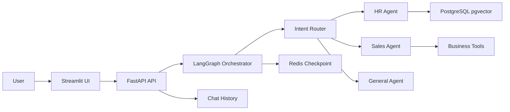

# AgentFlow Platform

AgentFlow is an MVP for an enterprise AI agent orchestration platform. It combines a FastAPI backend, LangGraph-based multi-agent routing, Redis short-term memory, PostgreSQL/pgvector RAG, mock business tools, DLP filtering, and a Streamlit chat UI.

## Architecture



## Quick Start

1. Create local configuration:

```bash
cp .env.example .env
```

2. Fill in `DEEPSEEK_API_KEY` and `DEEPSEEK_BASE_URL` in `.env`.

3. Install dependencies:

```bash
python3 -m venv venv
source venv/bin/activate
make install-dev
```

4. Start Postgres/pgvector and Redis:

```bash
make infra-up
```

To run the full stack in Docker, including API and UI images:

```bash
docker compose --profile app up --build
```

5. Start the API:

```bash
make dev-api
```

6. In another terminal, start the UI:

```bash
make dev-ui
```

Open the Streamlit URL and try:

- `查询差旅报销政策`
- `手机号 13800138000 最近有哪些订单？`
- `把订单 ORD-20250502-010 改成已发货`

## API

- `GET /healthz`: process health.
- `GET /readyz`: dependency readiness for Postgres, Redis, and required LLM env vars.
- `GET /metrics`: lightweight Prometheus-compatible counters.
- `POST /api/v1/auth/register`: create a local account. The first account is admin.
- `POST /api/v1/auth/login`: login and receive a JWT.
- `GET /api/v1/auth/me`: current user profile.
- `GET /api/v1/admin/stats`: admin-only usage analytics.
- `GET /api/v1/sessions`: persisted session summaries.
- `GET /api/v1/sessions/{session_id}/messages`: messages for one session.
- `POST /api/v1/agent/chat`: run one agent turn.

When `API_KEYS` is set, send `Authorization: Bearer <key>` or `X-API-Key: <key>`.

## Configuration

| Variable | Purpose |
| --- | --- |
| `DEEPSEEK_API_KEY` | DeepSeek API key. |
| `DEEPSEEK_BASE_URL` | OpenAI-compatible DeepSeek base URL. |
| `DATABASE_URL` | PostgreSQL connection string. |
| `REDIS_URL` | Redis connection string. |
| `API_KEYS` | Comma-separated API keys. Empty disables auth for local development. |
| `CORS_ALLOW_ORIGINS` | Comma-separated browser origins allowed to call the API. |
| `AGENTFLOW_API_BASE_URL` | Backend base URL used by the Streamlit frontend. |
| `JWT_SECRET` | HMAC secret used to sign login tokens. |
| `JWT_REFRESH_EXPIRES_SECONDS` | Refresh token lifetime (seconds). |
| `APP_ENV` | Set `production` on public servers to enforce security checks. |
| `UVICORN_RELOAD` | Keep `false` in production. |
| `POSTGRES_USER` / `POSTGRES_PASSWORD` / `POSTGRES_DB` | Used by `compose.prod.yaml` for Postgres. |
| `REDIS_PASSWORD` | Required Redis password in production compose. |
| `PUBLIC_APP_ORIGIN` | HTTPS origin of the Streamlit site (CORS), e.g. `https://chat.example.com`. |
| `PUBLIC_API_BASE_URL` | HTTPS base URL of the API as seen by the browser, e.g. `https://api.example.com`. |
| `ESTIMATED_COST_USD_PER_1K` | Cost estimate used by the admin dashboard. |

## Push to GitHub (open source / resume)

Do this on your laptop or WSL with the project folder as the working directory.

1. **Never commit secrets.** Confirm `.env` is ignored (already listed in `.gitignore`). Only commit `.env.example`.

2. Initialize Git and make the first commit:

```bash
cd agentflow-platform
git init
git add .
git status   # verify .env is NOT listed
git commit -m "Initial commit: AgentFlow platform"
```

3. Create an empty repository on GitHub (no README/license if you already have them locally), then:

```bash
git branch -M main
git remote add origin https://github.com/<your-username>/<your-repo>.git
git push -u origin main
```

4. **Optional checks**

   - Enable GitHub Actions if `.github/workflows/ci.yml` is present (tests run on push).
   - Add a short repo description and topics: `fastapi`, `langgraph`, `streamlit`, `rag`, `agents`.

If you ever copied a real `.env` into the repo by mistake, rotate all secrets (`JWT_SECRET`, DB password, Redis password, API keys) before pushing.

## Production: stable URL for friends (VPS + Docker + Nginx + HTTPS)

Goal: friends open `https://<your-chat-domain>` in a browser, register/login, and chat. The API is at `https://<your-api-domain>`.

**Full step-by-step** (security group, Certbot, troubleshooting): **[docs/deployment.md](docs/deployment.md)**.

### Summary checklist

1. **Buy a VPS** (e.g. Ubuntu 22.04/24.04, 2 vCPU / 4 GB RAM). Note its public IP.

2. **DNS** (at your domain registrar):

   - `A` record: `chat.example.com` → VPS IP (Streamlit front).
   - `A` record: `api.example.com` → VPS IP (FastAPI).

   Replace with your real subdomains.

3. **Security group / firewall**: allow inbound **TCP 22** (SSH), **80**, **443** only. Do **not** open `5432`, `6379`, `8000`, `8501` to the world.

4. **On the server**, install Docker and clone your repo (HTTPS or SSH):

```bash
sudo apt-get update && sudo apt-get install -y git
curl -fsSL https://get.docker.com | sudo sh
sudo systemctl enable --now docker
sudo usermod -aG docker "$USER"
# log out and back in, then:
git clone https://github.com/<your-username>/<your-repo>.git agentflow-platform
cd agentflow-platform
cp .env.example .env
nano .env   # edit all production values; see table above and docs/deployment.md
```

5. **Fill `.env` for production** (minimal mental model):

   - Strong random `JWT_SECRET` (32+ chars).
   - Strong `POSTGRES_PASSWORD`, `REDIS_PASSWORD` (not demo defaults).
   - `PUBLIC_APP_ORIGIN=https://chat.example.com` and `PUBLIC_API_BASE_URL=https://api.example.com` (exact HTTPS URLs users use).
   - `DATABASE_URL` inside containers is overridden by `compose.prod.yaml`; local `.env` still needs `POSTGRES_*` and `REDIS_PASSWORD` for Compose substitution.

6. **Start the stack**:

```bash
docker compose -f compose.prod.yaml up -d --build
bash scripts/check-deploy.sh
```

7. **Install Nginx + HTTPS** on the host:

   - Copy [docs/nginx-agentflow.conf](docs/nginx-agentflow.conf) to `/etc/nginx/sites-available/`, fix `server_name` to your domains.
   - `sudo nginx -t && sudo systemctl reload nginx`
   - `sudo certbot --nginx -d chat.example.com -d api.example.com`

8. **First admin**: open the chat URL, **Register** the first account — it becomes admin. Share the URL with friends; they **Register** separately (each user sees their own sessions).

9. **Operational habits**: periodic `scripts/backup-postgres.sh`, monitor disk and `docker compose logs`.

`compose.prod.yaml` binds API/UI to **127.0.0.1** so only Nginx on the same machine should talk to ports 8000/8501.

**新手逐步图文式说明（阿里云轻量 + Cloudflare 代理）：** [docs/deploy-beginner-aliyun-cloudflare-zh.md](docs/deploy-beginner-aliyun-cloudflare-zh.md)

## Development

```bash
make lint
make test
```

The project intentionally ignores `.env`, `venv/`, caches, logs, and local databases. Do not commit secrets or generated virtual environments.

## Notes

The current business tools and seed knowledge-base content are demo data. The HR policy seed is inserted for local smoke testing; production RAG should ingest real documents with real embeddings and source metadata.
